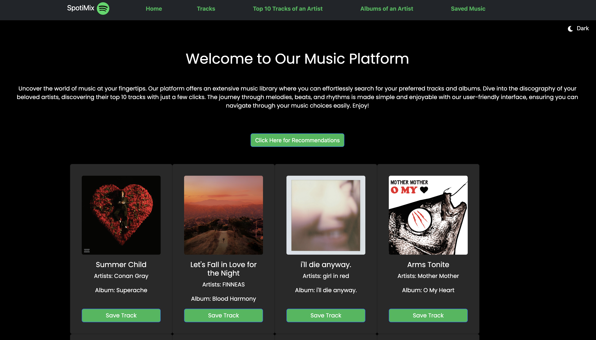
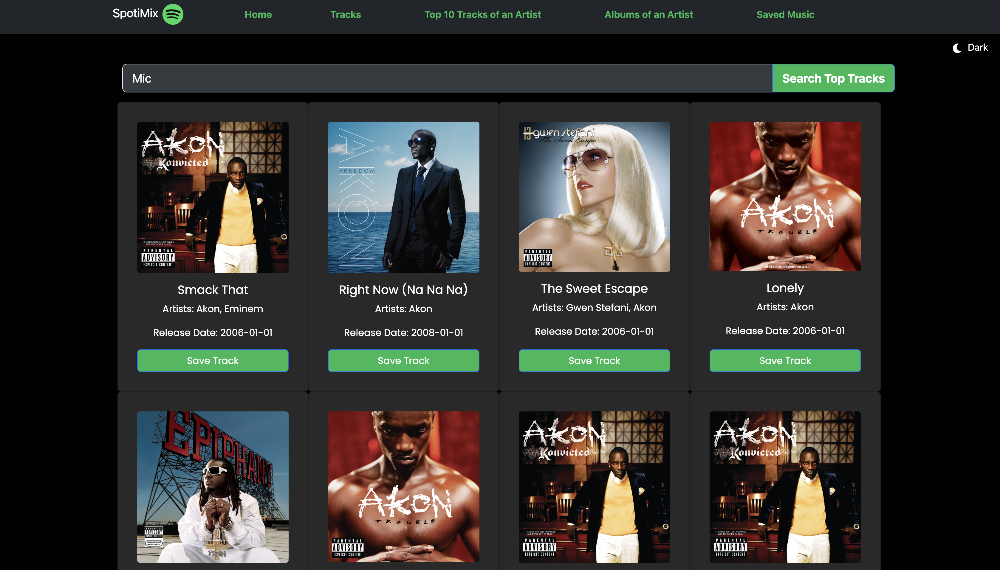
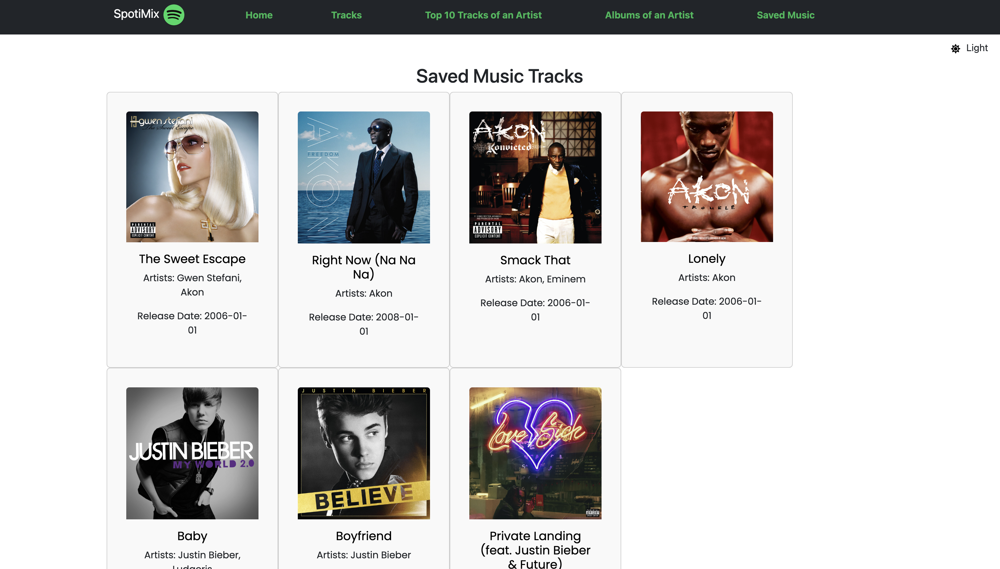

# SpotiMix

SpotiMix is a React-based web application that leverages the Spotify API to provide users with an interactive platform for exploring music. The application offers features like saving tracks, implementing a light and dark theme, and providing the option for users to upgrade for unlimited saves.

### Finding a Track:

1. The user navigates to the "Tracks" route, which lists available tracks or provides a search option.
2. The user searches for a track using the search feature.
3. The user selects a track from the search results or track listing.

### Saving a Track:

1. On the track details page, the user clicks on a "Save Track" button.
2. This triggers a function that captures the track information (name, artist, album, etc.) and triggers an API call or a function to save the track details.
3. The track details (or a reference to them) are stored in the state, potentially along with a unique identifier like track ID.

### Checking Saved Music:

1. The user navigates to the "Saved Music" route.
2. This route accesses the saved track information from the state.
3. It displays the saved tracks, potentially with their album art, names, artists, and other relevant details.
4. If the user has more than 8 saved tracks (unlimited with payment), it displays a message or button to encourage upgrading to a premium plan.

### Technologies Used
* React: The entire application is built using React, a popular JavaScript library for building user interfaces.
* React Bootstrap: The UI of the application is designed using React Bootstrap, which provides pre-styled components to enhance the overall user experience.
* Context API: React's Context API is used to manage and pass the application's theme state to various components, enabling seamless switching between light and dark themes.
* Spotify API: The Spotify API is utilized to fetch music recommendations, album details, top tracks, and more, allowing users to explore a vast collection of music.
* React Router: React Router is employed to handle routing within the application, enabling navigation between different pages and components.
* Stripe: Integration with Stripe enables a seamless payment experience, allowing users to upgrade to a premium plan for unlimited saves at just $5.

Features
* Light and Dark Theme: The application offers users the choice of a light or dark theme to personalize their experience. This choice is persisted across different sessions.
* Track Saving: Users can save up to 8 tracks for free. The application facilitates a smooth process to save and manage their favorite tracks.
* Stripe Integration: Users can opt for a premium plan by making a one-time payment of $5 through the integrated Stripe payment gateway. This upgrade allows unlimited track saves.

### Deployment

SpotiMix is live and accessible at https://spoti-mix.vercel.app/. Explore and enjoy the endless possibilities of music at your fingertips!

